# trabalhoWeb1
Repositório dedicado ao trabalho desenvolvido para a disciplina de POO para Web 1

O trabalho consiste em um fórum de tópicos, nele os usuários podem postar, editar e excluir
seus tópicos, assim como visualizar e comentar as postagens de outros.

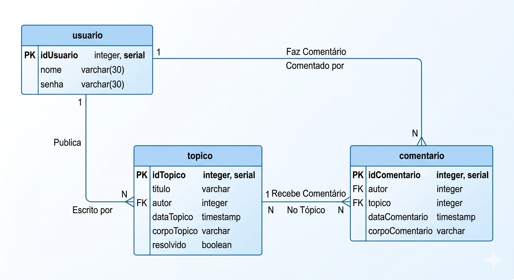

Aqui o usuário insere nome e senha para entrar na página principal.

Aqui o usuário faz o seu cadastro. Importante notar que o sistema só
permite um usuário por nome.

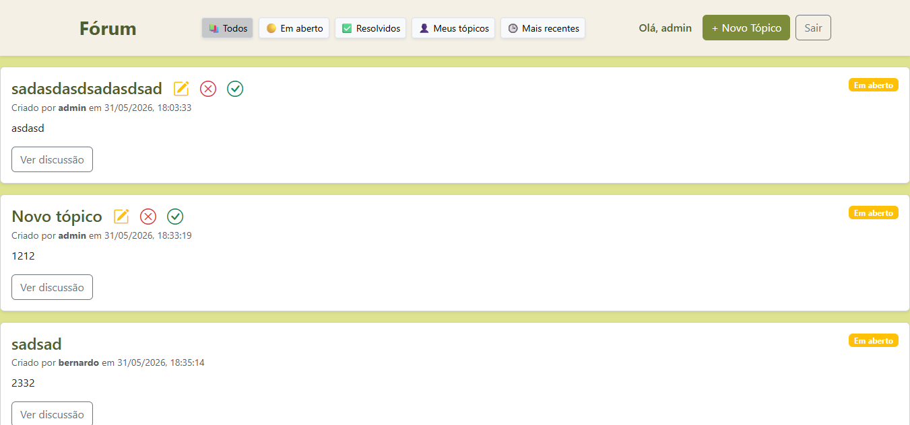
Aqui encontram-se todas as postagens existentes no sistema, os usuários podem
filtrar pelas várias opções que aparecem no meio da navbar.

Essas opções dão a chance ao usuário autor do tópico de editar, excluir e resolver ou
reabrir um tópico com um clique.

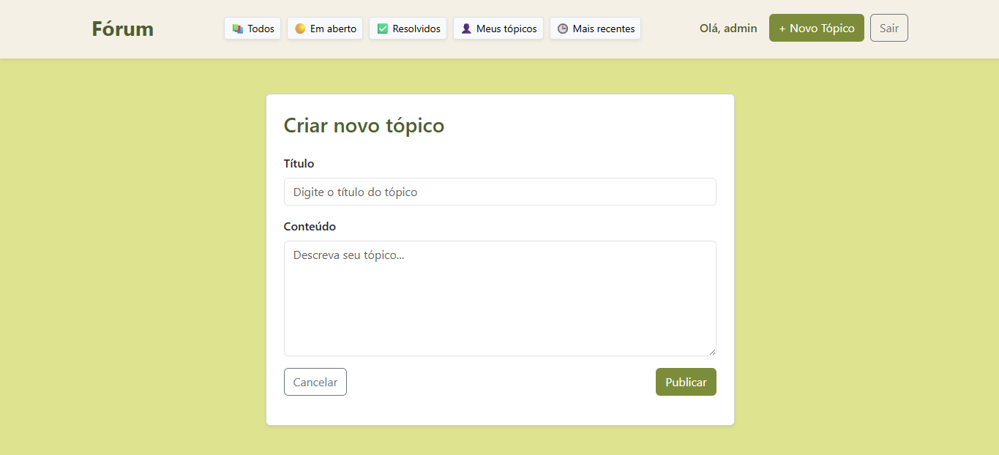
Ao clicar no botão de novo tópico, o usuário insere o título e o conteúdo do tópico,
postando ao clicar em Publicar.

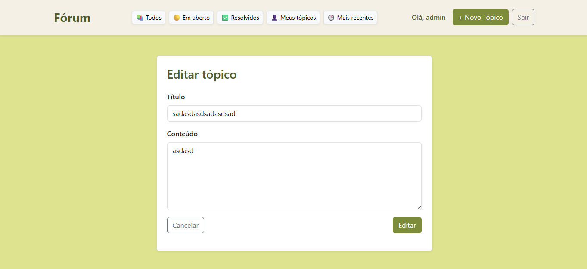
Se o usuário clicar no botão de edição do tópico nas postagens, ele terá a chance de
inserir novos valores aos campos de titúlo e conteúdo

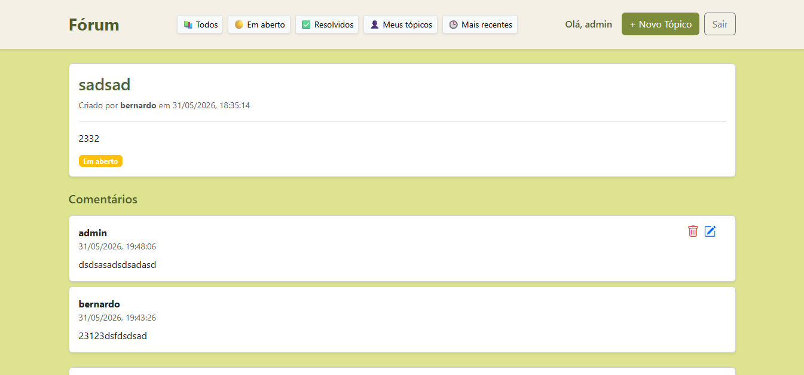
Se o usuário clicar em Ver Discussão na listagem, ele poderá ver os comentários daquele tópico
e fazer o seu próprio comentário mais abaixo. O autor do tópico tem o poder de deletar comentários dentro de seu tópico,
mas apenas o autor do comentário pode deletar E editar os seus comentários. 

# Instalacao do Software

Uso o Intellij para fazer a configuração do servidor WildFly 39.0.1 Final e só há suporte pela versão Ultimate.
Uso também o postgres como banco de escolha, a base de dados é a que aparece a seguir e uma nova deve
ser criada ao clonar o projeto, mas o sql com dados mockados está presente no projeto para facilitação.

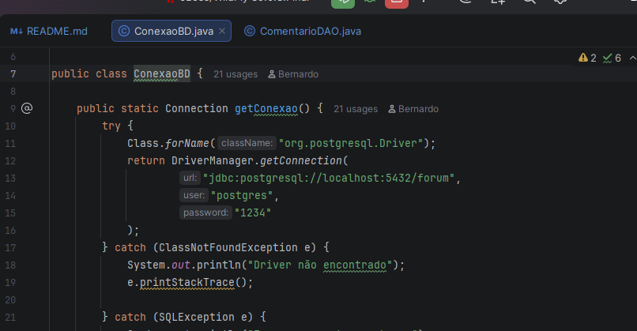

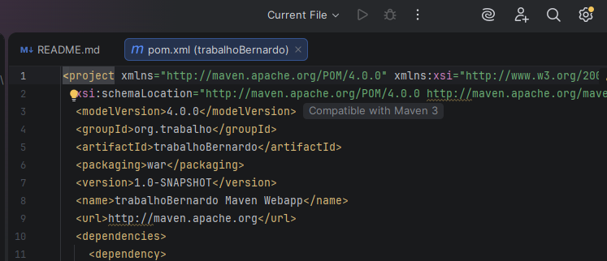

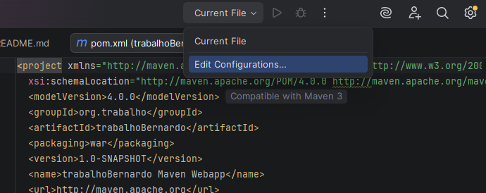

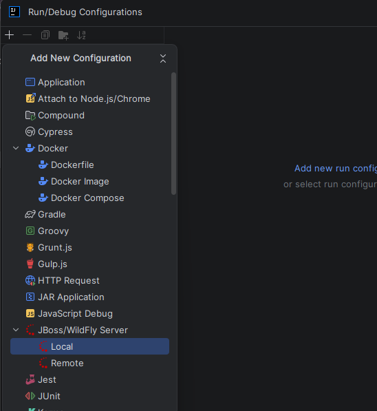

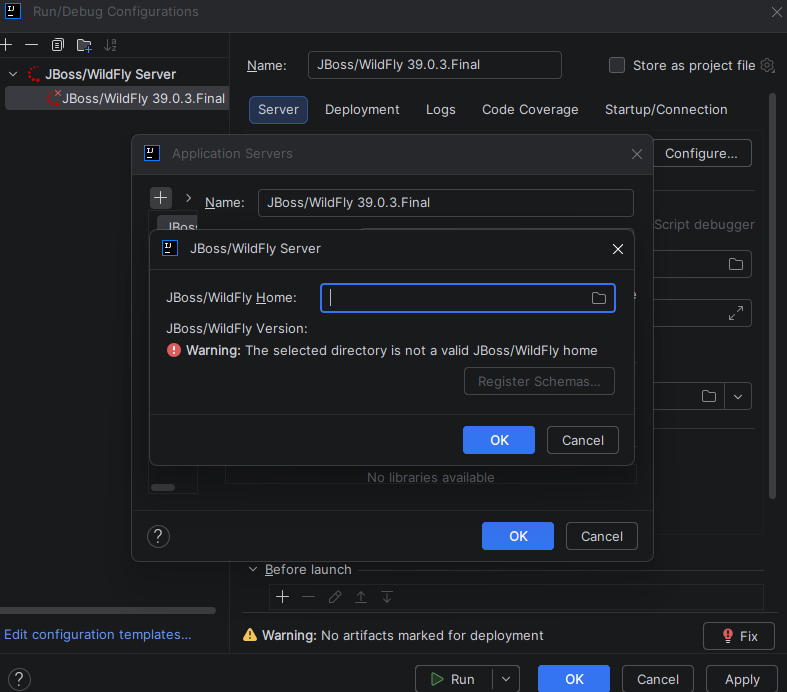
Selecionar o caminho do WildFly

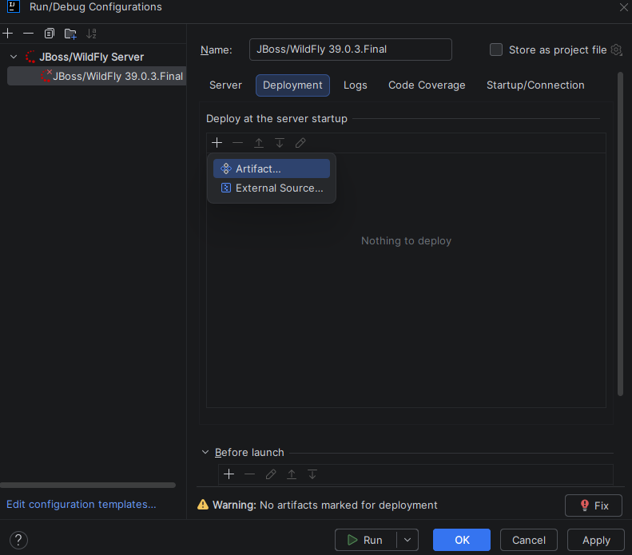

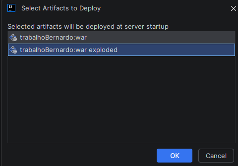